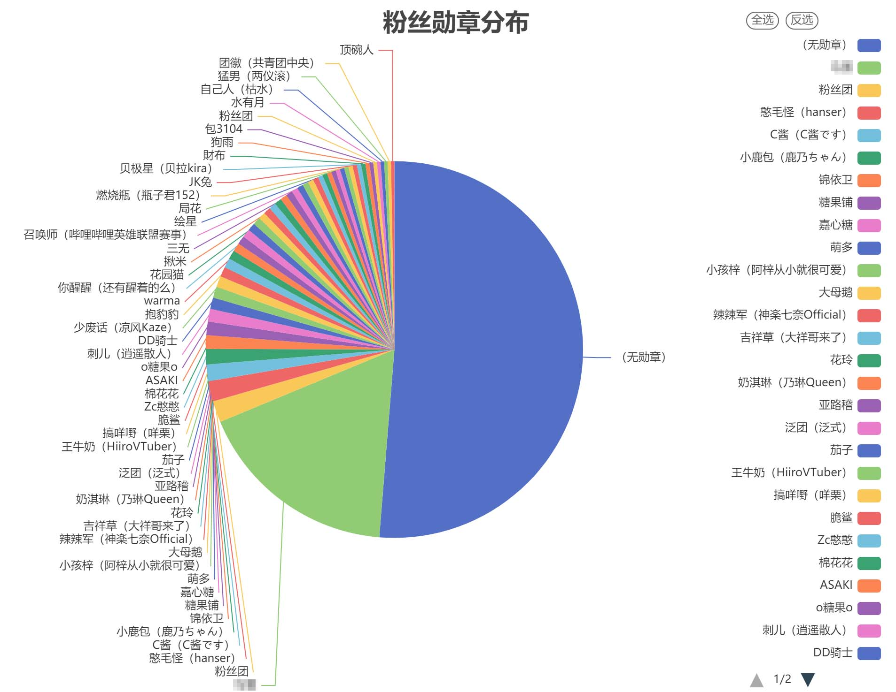
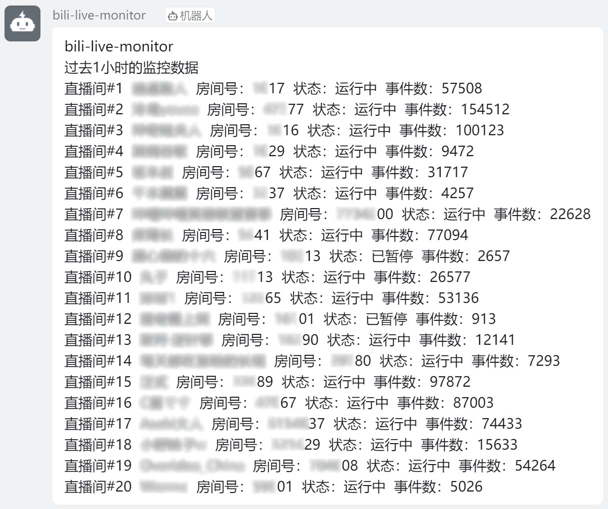
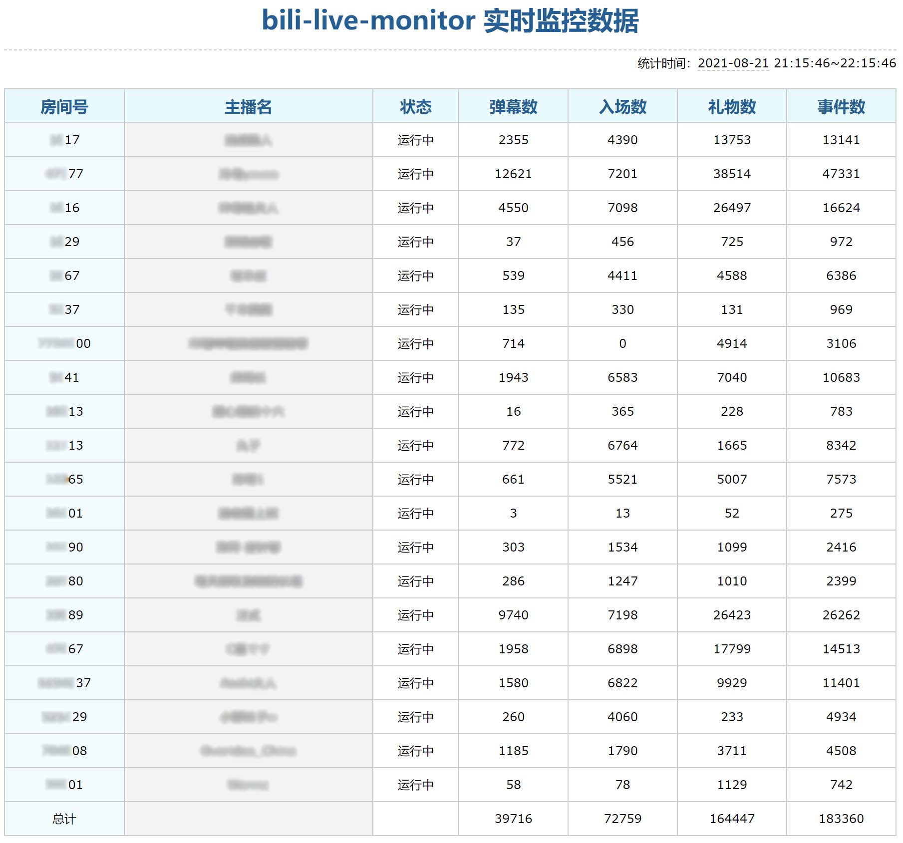

# bili-live-monitor

监控哔哩哔哩直播间数据，实时保存至数据库，并在内置网页上查看精致的可视化统计图表。

可部署至Windows, MacOS, Linux云服务器，甚至Android。

**该项目仅用于学习和测试，请勿滥用。如加载慢，可访问[镜像仓库](https://gitee.com/jellyblack/bili-live-monitor)。**

<details>
    <summary>版本更新记录</summary>

### 0.6.0
- 添加内置网页导出CSV的功能
- 支持导出弹幕数量动态排行CSV（用于见齐的数据可视化项目）
### 0.5.0
添加弹幕合并功能（pakku.js提供支持）
### 0.4.0
支持查看以下统计图：
- 弹幕数量折线图（合计）
- 弹幕数量折线图（排行）
- 粉丝勋章分布
- 粉丝勋章等级分布
- 直播间等级分布
### 0.3.0
支持查看以下统计图：
- 观众入场折线图
- 人气变化折线图
- 粉丝数变化折线图
- 醒目留言折线图
- 购买舰长折线图
- 直播事件折线图
- 入场效果折线图
- 送礼数量折线图
### 0.2.0
- 支持更多监控项：购买舰长、入场效果、醒目留言
- 添加请求间隔，防止触发412错误
- 支持仅监控开播时的数据、关播则停止监控
- 支持钉钉和邮件通知
- 其他细节优化
### 0.1.0
第一个版本

</details>

## 准备

该项目依赖**Node.js** 7.6（V8版本 5.5）及以上版本。请确保已安装Node.js。运行`node --version`查看Node.js版本号。

### Windows/MacOS安装Node.js
前往Node.js官网（https://nodejs.org/zh-cn/ ）下载对应的安装包，安装即可。建议下载长期支持（LTS）版。

### Linux安装Node.js

```shell
# 先cd到某个目录
wget https://nodejs.org/dist/v14.17.5/node-v14.17.5-linux-x64.tar.xz
tar xf node-v14.17.5-linux-x64.tar.xz
cd node-v14.17.5-linux-x64/
./bin/node -v
# 设置符号链接
ln -s ./bin/npm   /usr/local/bin/ 
ln -s ./bin/node   /usr/local/bin/
```

### Android安装Node.js

访问以下链接下载Termux：https://f-droid.org/zh_Hans/packages/com.termux/

Termux是带有软件包的终端模拟器。打开Termux，执行`pkg install nodejs`即可。

------

该项目需要**MySQL**数据库以存储数据（你也可以在配置里禁用）。Windows, MacOS, Linux安装MySQL的方法请上网搜索，这里不再赘述。也可以选择各主机商的云数据库。

注意：最好在同一终端上运行监控和服务器，或两者处在同一内网。

### Android安装MySQL

打开Termux，执行`pkg install mariadb`即可。

安装后，为bili-live-monitor指定一个用户，至少应拥有以下全局权限：SELECT, INSERT, UPDATE, CREATE, INDEX, DROP, SHOW DATABASES, CREATE TEMPORARY TABLES。

------

需要Git克隆项目，请确保已安装Git。Android使用`pkg install git`安装。

## 安装与运行

### 安装

```shell
git clone https://github.com/JellyBlack/bili-live-monitor
cd bili-live-monitor
npm install
```

或者从镜像仓库克隆：

```shell
git clone https://gitee.com/jellyblack/bili-live-monitor
```

### 配置

项目根目录下有一个`config.js`文件，编辑以调整配置。文件内有详细注释。

使用`git checkout config.js`以恢复默认配置。

### 运行

```shell
npm start
```

在Linux环境下，可以使用`nohup npm start &`以不中断地运行项目。

如果想在Android机上不间断地运行，须关闭省电优化等一系列设置，确保Termux始终运行。

### 管理

运行`npm run console`进入监控控制台，可以切换监控状态、安全停止监控。

**一定要安全停止！** 使用Ctrl+C停止会丢失缓冲区的数据。

## 统计
运行`npm run chart`可运行本地HTTP服务器，访问相应地址（默认为http://localhost:8080 ）可查看图表。当然，也可以在`config.js`里调整配置以供外网访问。（不过简易HTTP服务器没有过多的安全措施，请谨慎）

打开网页，请在**下拉列表**中选择希望统计的数据库和图表类型。针对某些图表，还可以选择数据源或用户来源。（关于合并弹幕请参考下文）

点击“**导出CSV**”按钮，可导出Excel可查看的CSV文件，用于在Excel中生成图表。

有一个特殊的图表类型“**弹幕数量动态排行**”，可导出用于见齐的动态排行数据可视化项目的CSV数据源。[点此访问项目地址](https://github.com/Jannchie/Historical-ranking-data-visualization-based-on-d3.js)。

可以用滑动条选择需要的**时间粒度**，从1秒到24小时不等。时间粒度指的是以多长的时间为单位组合数据。直观而言，时间粒度越小，图表越精细，锯齿状波动越多（渲染压力也越大）；时间粒度越大，图表越简略，锯齿状波动越少。调试并选择**合适的时间粒度**有利于数据合理的展现。

图表右上角有**工具箱**，有区域缩放、切换图表类型、下载png图片等功能。坐标系类图表下方有**区域缩放**控件，可展示部分数据的详细信息。

注：如下拉列表中无欲选择的数据库，请尝试删除`histroy/database_histroy.json`。

以下为图表示例。




## 工具箱

运行`npm run tools`打开工具箱，目前提供弹幕合并功能。

注：如无欲选择的数据库，请尝试删除`histroy/database_histroy.json`。

### 弹幕合并

该功能由[pakku.js](https://github.com/xmcp/pakku.js)提供支持，可合并弹幕。合并后的弹幕写入`danmaku_combined`数据表中。

通过编辑距离、2-Gram词频向量、谐音等多个维度全方位合并相似弹幕，在弹幕数量排行等统计中尤其有用。

## 用SQL导出CSV文件

**内置网页中展示的图表，都可以下载对应的CSV文件。此部分供自定义导出使用。**

如需使用见齐的动态排序柱状图，请参考上文“统计”，此处不能导出所需CSV文件。

以下为导出示例。当然，你也可以导出更多种类的表格，只需编写SQL即可。

**`INTO OUTFILE`后面的`...`替换为CSV文件存放的路径，如`./danmaku.csv`。**

如需要添加条件，则在注释的地方添加WHERE子句（去掉注释），如`WHERE time > '2021-08-23 21:34:00'`。如需限制导出的数量，则在注释的地方添加`LIMIT <最大数量>`（去掉注释）。

如果报`--secure-file-priv`错误，请参考[这篇博客](https://www.cnblogs.com/Braveliu/p/10728162.html)解决。受权限限制，不能导出至任意文件夹，请导出后手动移动位置。如需要表头，手动添加即可。

### 弹幕数量排行

```sql
SELECT text, COUNT(*) FROM danmaku /* WHERE ... */
GROUP BY text ORDER BY COUNT(*) DESC /* LIMIT ... */
INTO OUTFILE '...' CHARACTER SET gbk
FIELDS ENCLOSED BY '"'
TERMINATED BY ','
ESCAPED BY '"'
LINES TERMINATED BY '\r\n';
```

如需要导出合并后的弹幕数据，把`danmaku`替换成`danmaku_combined`即可。

导出示例

| text               | COUNT(*) |
| ------------------ | -------- |
| 哈哈哈哈哈哈哈哈哈 | 1421     |
| 23333333333        | 1312     |
| awsl               | 1028     |

### 礼物种类排行

```sql
SELECT gift_name, COUNT(*) FROM gifts /* WHERE ... */
GROUP BY gift_id ORDER BY COUNT(*) DESC /* LIMIT ... */
INTO OUTFILE '...' CHARACTER SET gbk
FIELDS ENCLOSED BY '"'
TERMINATED BY ','
ESCAPED BY '"'
LINES TERMINATED BY '\r\n';
```

导出示例

| gift_name | COUNT(*) |
| --------- | -------- |
| 小心心    | 46123    |
| 辣条      | 12468    |
| 心动卡    | 820      |

### 用户发送弹幕数排行

```sql
SELECT u.username, COUNT(*) FROM danmaku d
INNER JOIN users_from_danmaku u ON d.user_mid=u.user_mid
/* WHERE ... */
GROUP BY d.user_mid ORDER BY COUNT(*) DESC /* LIMIT ... */
INTO OUTFILE '...' CHARACTER SET gbk
FIELDS ENCLOSED BY '"'
TERMINATED BY ','
ESCAPED BY '"'
LINES TERMINATED BY '\r\n';
```

导出示例

| username   | COUNT(*) |
| ---------- | -------- |
| JellyBlack | 310      |
| 小号生     | 182      |
| 碧诗       | 92       |

以上仅为示例，还可以导出更多种类的CSV。

## 通知

bili-live-monitor支持钉钉通知和邮件通知，便于及时推送统计数据。
### 钉钉通知

在钉钉创建一个群聊，添加自定义机器人。官方文档地址：https://developers.dingtalk.com/document/robots/custom-robot-access 

勾选“自定义关键词”安全设置，关键词填写“bili-live”或“monitor”。暂不支持签名，请勿勾选“加签”。

将Webhook地址填入config.js文件中。



### 邮件通知

请参考config.js的注释进行设置。一般在邮箱的设置界面开启SMTP服务。邮件采用HTML格式。



## 其他

### 查看直播间房间号


### 感谢

感谢以下项目对bili-live-monitor的开发提供帮助。

[**pakku.js**](https://github.com/xmcp/pakku.js)：提供弹幕合并算法（遵循[GPL-3.0开源协议](https://github.com/xmcp/pakku.js/blob/master/LICENSE.txt)）

[**ECharts**](https://echarts.apache.org/)：提供可视化图表库

[**bilibili-live-ws**](https://github.com/simon300000/bilibili-live-ws)：提供哔哩哔哩直播TCP/WS API

[**bilibili-API-collect**](https://github.com/SocialSisterYi/bilibili-API-collect)：提供直播相关API

### 开发者

**JellyBlack**

QQ：1574854804

Email：l45531@126.com

